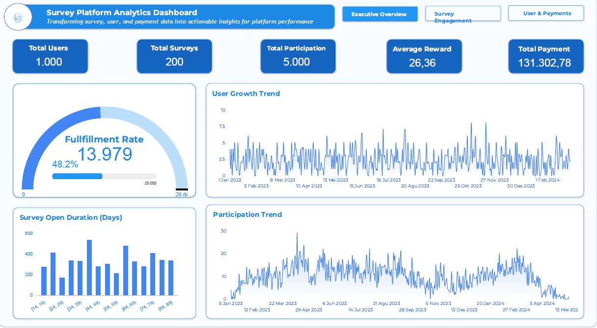
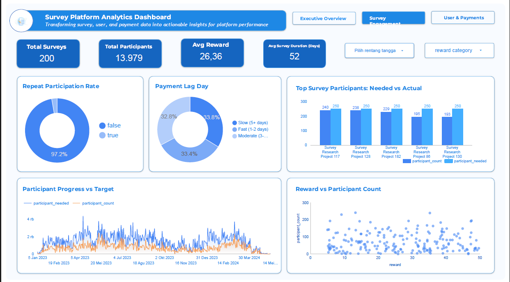
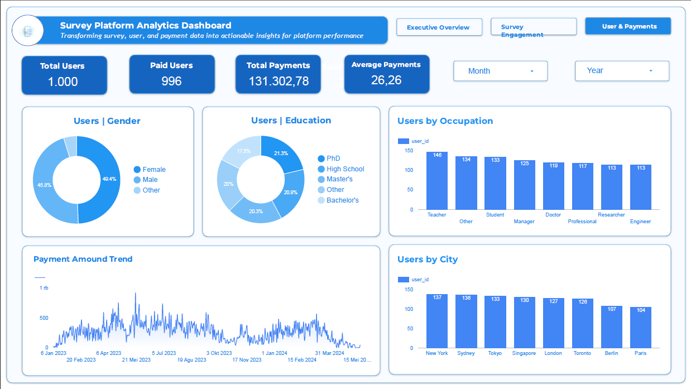

<div align="center">

# Survey Platform Analytics Dashboard


<br/>

### Interactive analytics dashboard for monitoring survey performance, user engagement, participation, and payment activities.

<br/>


<br/><br/>

[Overview](#-overview) •
[Objectives](#-project-objectives) •
[Dashboard](#-dashboard-sections) •
[Tech Stack](#-tech-stack) •
[Workflow](#-project-workflow) •
[My Role](#-my-role) •
[Repository](#-repository-structure)

</div>

---

## 📌 Overview

**Survey Platform Analytics Dashboard** is an interactive business intelligence dashboard developed during my **Data Analyst Internship at Kudata.id**.

The dashboard was designed to provide a comprehensive overview of survey platform activities, including **survey performance, user engagement, participation behavior, fulfillment performance, reward distribution, and payment activities**.

The project transforms raw survey platform data into structured and meaningful visual insights that support performance monitoring, engagement analysis, and data-driven decision-making.

The dashboard was developed using **Looker Studio** for interactive visualization and **Microsoft Excel** for data preparation, transformation, validation, and analysis.

---

## 🎯 Project Objectives

The main objectives of this project were to:

- Monitor overall survey platform performance.
- Track user growth and survey participation trends.
- Evaluate survey engagement and completion performance.
- Measure survey fulfillment rates.
- Compare participant achievement against survey targets.
- Analyze repeat participation behavior.
- Understand user demographic characteristics.
- Monitor payment and reward activities.
- Provide stakeholders with an interactive dashboard for performance monitoring.
- Transform raw survey platform data into actionable business insights.

---

## 📊 Dashboard Sections

The dashboard consists of three main analytical sections:

### 1. Executive Overview

The **Executive Overview** provides a high-level summary of the platform's overall performance.

It allows stakeholders to quickly monitor the most important platform metrics and understand general trends in users, surveys, participation, and payments.

#### Key Performance Indicators

- Total Users
- Total Surveys
- Total Participation
- Total Payment
- Average Reward
- Fulfillment Rate

#### Analysis

- User Growth Trend
- Survey Participation Trend
- Platform Activity Overview
- Survey Performance Summary
- Payment Performance Summary

<p align="center">
  
</p>

---

### 2. Survey Engagement & Performance

The **Survey Engagement & Performance** section focuses on evaluating how users participate in surveys and how effectively surveys achieve their participation targets.

This section helps identify survey engagement patterns, completion performance, and participant behavior.

#### Analysis

- Participant Progress
- Survey Fulfillment Rate
- Reward Distribution
- Survey Duration
- Participant Achievement vs. Target
- Repeat Participation Rate
- Survey Engagement Performance
- Survey Completion Performance

This analysis enables stakeholders to evaluate whether surveys are successfully attracting participants and achieving their predefined targets.

<p align="center">
  
</p>

---

### 3. User & Payment Analysis

The **User & Payment Analysis** section provides deeper insights into platform users and payment activities.

The analysis combines demographic information with transaction-related metrics to provide a more comprehensive understanding of platform engagement.

#### User Analysis

- User Demographics
- Occupation Distribution
- City Distribution
- Education Level
- User Distribution
- User Characteristics

#### Payment Analysis

- Paid Users
- Total Payment Amount
- Payment Trends
- Reward Distribution
- Payment Activity
- Payment Performance

This section helps stakeholders better understand the characteristics of platform users and monitor reward and payment activities.

<p align="center">
  
</p>

---

## 🛠️ Tech Stack

<div align="center">


</div>

| Technology | Usage |
|---|---|
| **Looker Studio** | Interactive dashboard development, KPI visualization, performance monitoring, filtering, and reporting |
| **Microsoft Excel** | Data cleaning, preprocessing, transformation, validation, aggregation, and dataset preparation |

---

## 🔄 Project Workflow

The project followed an end-to-end data analytics workflow.

```text
Raw Survey Platform Data
           │
           ▼
     Data Collection
           │
           ▼
   Data Cleaning & Validation
           │
           ▼
     Data Transformation
           │
           ▼
     Metric Calculation
           │
           ▼
      KPI Development
           │
           ▼
 Exploratory Data Analysis
           │
           ▼
   Dashboard Development
           │
           ▼
 Visualization & Monitoring
           │
           ▼
     Business Insights
